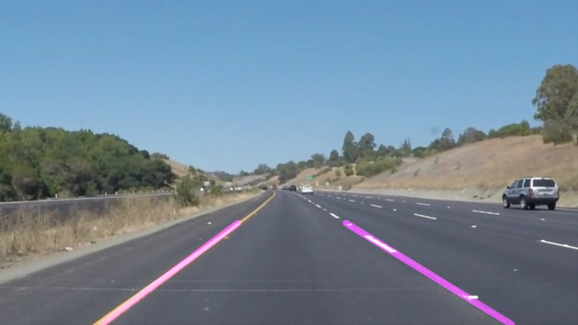
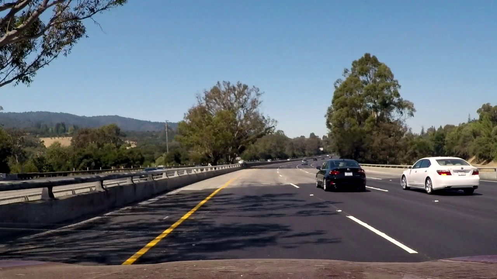
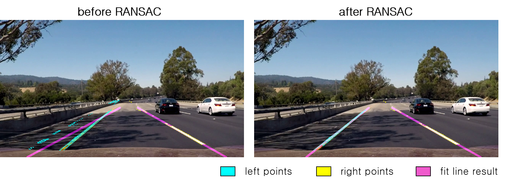

#**Finding Lane Lines on the Road** 

####My first project of the Udacity's 'Self Driving Car Nanodegree' was `Finding lane lines`.
####In this project, I mainly considered **'How to erase outliers'**.

####Here is my pipeline

##**Step 1:** Find lines in image

1. Set ROI(Region Of Interest)
  * To reduce computing cost
2. Apply gaussian filter
3. Apply Canny edge transform
4. Perform hough transform 
  * Get first candidates for real lane lines
 
##**Step 2:** Find inliers & outliers

> ###**I used RANSAC algorithm to eliminate outliers.**
> *`RANSAC : Random Sample Consensus`*

1. Interpolation
 *  Need more sample points for RANSAC's good result 
 - We know each line's startpoint & endpoint. We could get more points between them.
2. Get random samples
 * Extract 2 random points in sample
 - Get line equation between them
3. Compute cost
 * Compute distance between sample points and the line.
 - cost = sum of distance
 + **Iterate 2, 3 and remember the min_cost line**
4. Erase outliers
 * Compute distance between sample points and the min_cost line.
 - If distance > threshold : outliers (Erase it)

##**Step 3:** Draw line in image

*  Extrapolation using `fitline()` function after erasing outliers
-  frame-to-frame smoothing (I got this idea from other SDC members. Thanks!) 

##**Result of RANSAC**

Unexpected lines are detected because of shadow.
If I adjust parameters of canny or hough transform, I might erase outliers in the image.
But the adjusted parameter is not a perfect parameter in all frames.
So I have tried RANSAC and this is the result.

##**Result on Video**

### solidWhiteRight

### solidYellowLeft

### challenge

